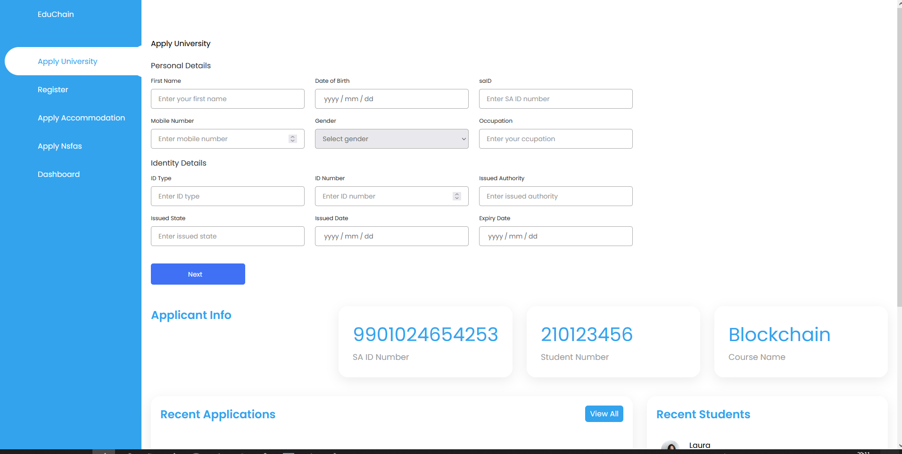
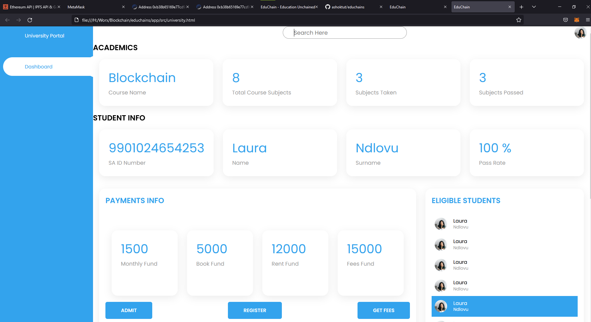
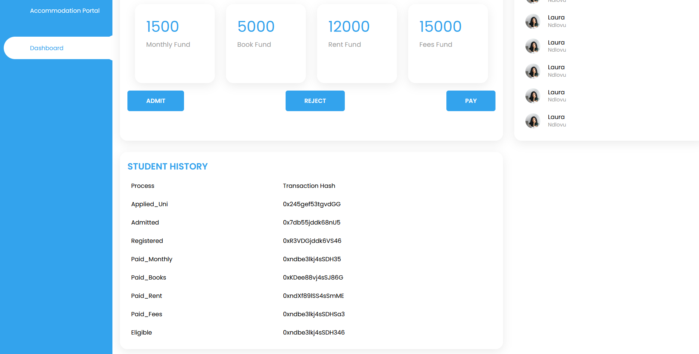
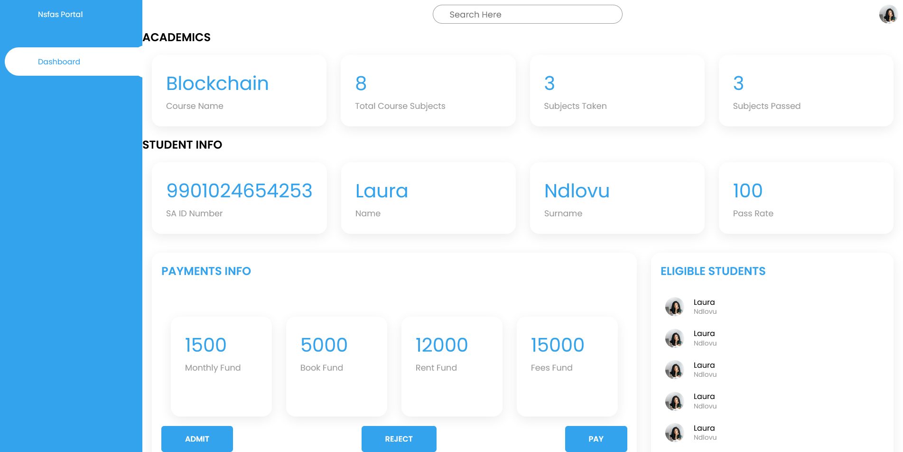

# EduChain Tracking & data auditing

This repository contains an Ethereum DApp that demonstrates a Chain flow between a Student and Associated Entities related to the disbursement of funds to cover student expenses such as monthly allowance and book allowance, university fees, accommodation fees.

The DApp User Interface when running should look like...











## Design Class Diagrams


## Communication Diagrams


## Sequence Diagram


## First Cut Design Class Diagram


## Getting Started

These instructions will get you a copy of the project up and running on your local machine for development and testing purposes. See deployment for notes on how to deploy the project on a live system.

### Prerequisites

Please make sure you've already installed ganache-cli, Truffle and enabled MetaMask extension in your browser.

```
Give examples (to be clarified)
```

### Installing

> The starter code is written for **Solidity v0.8.0**. At the time of writing, the current Truffle v5 comes with Solidity v0.5 that requires function *mutability* and *visibility* to be specified (please refer to Solidity [documentation](https://docs.soliditylang.org/en/v0.5.0/050-breaking-changes.html) for more details). To use this starter code, please run `npm i -g truffle` to install Truffle with Solidity v0.8.0.

A step by step series of examples that tell you have to get a development env running

Clone this repository:

```
git clone https://github.com/ashoktut/educhains.git
```

Change directory to ```educhains``` folder and install all requisite npm packages (as listed in ```package.json```):

```
cd educhains
npm install
```

Launch Ganache:

```
ganache-cli -m "test fail rug dumb soldier matrix multiply eager brown garage lens sense"
```

Your terminal should look something like this:


In a separate terminal window, Compile smart contracts:

```
truffle compile
```

Your terminal should look something like this:


This will create the smart contract artifacts in folder ```build\contracts```.

Migrate smart contracts to the locally running blockchain, ganache-cli:

```
truffle migrate
```

Your terminal should look something like this:


Test smart contracts:

```
truffle test
```

All tests should pass.


In a separate terminal window, launch the DApp (Frontend):

```
npm run dev
```

```
Home Page:
```


## Etherscan Proof for Contract Deployment on Rinkeby Network

```
https://rinkeby.etherscan.io/address/0xB38B65169e77cD9A8dc6b64B69A73c114512c003
```


## Etherscan Proof for transactions on Goerli Network

```
https://goerli.etherscan.io/address/0xb38b65169e77cd9a8dc6b64b69a73c114512c003
```


## INFURA API for endpoints connected over goerli network

```
infura key embedded in project
```


## METAMASK

```
Install metamask wallet from chrome store or firefox extensions. It is open source and free
```


## Built With

* [Ethereum](https://www.ethereum.org/) - Ethereum is a decentralized platform that runs smart contracts
* [Truffle Framework](http://truffleframework.com/) - Truffle is the most popular development framework for Ethereum with a mission to make your life a whole lot easier.
* [Infura API](https://www.infura.io/) - The world's most powerful suite of high availability blockchain APIs and developer tools
* [Etherscan](https://etherscan.io/) - Tracks transactions on a public test network of Ethereum
* [Ganache](https://trufflesuite.com/ganache/) - Quickly fire up a personal Ethereum blockchain which you can use to run tests, execute commands, and inspect state while controlling how the chain operates.
* [Metamask](https://metamask.io/) - A crypto wallet & gateway to blockchain apps for Buy, store, send and swap tokens

## Versions Used

Truffle v5.5.28 (core: 5.5.28)
Ganache v7.4.0
Solidity - 0.8.0 (solc-js)
Node v14.17.0
Web3.js v1.7.4

## Authors

Ashok
